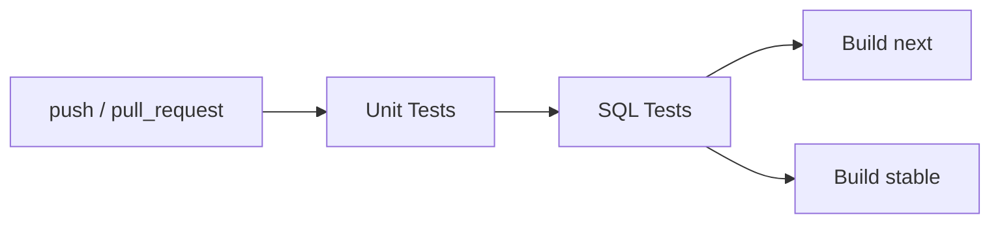

# Development

## Repository Layout

```
duckdb_gsheets/
├── src/                        # Extension source code
│   ├── include/                # Headers
│   │   ├── sheets/             # Google Sheets client library
│   │   │   ├── auth/           # Auth providers (bearer, OAuth, service account)
│   │   │   ├── resources/      # API resources (spreadsheets, values)
│   │   │   ├── transport/      # HTTP client abstraction
│   │   │   └── util/           # Encoding, range parsing
│   │   └── utils/              # Extension utilities (secrets, version)
│   ├── sheets/                 # Client library implementation
│   └── *.cpp                   # Extension entry points (read, copy, auth)
├── test/
│   ├── sql/                    # SQL logic tests (integration, requires credentials)
│   └── unit/                   # C++ unit tests (standalone, no credentials needed)
├── scripts/                    # Dev scripts (test runners, token generation)
├── docs/                       # Documentation site
├── .github/workflows/          # CI pipelines
├── duckdb/                     # DuckDB submodule
└── extension-ci-tools/         # DuckDB CI tooling submodule
```

## Building

### Managing dependencies

DuckDB extensions use VCPKG for dependency management. Follow the [installation instructions](https://vcpkg.io/en/getting-started) or run:

```shell
git clone https://github.com/Microsoft/vcpkg.git
./vcpkg/bootstrap-vcpkg.sh
export VCPKG_TOOLCHAIN_PATH=`pwd`/vcpkg/scripts/buildsystems/vcpkg.cmake
```

### Build steps

To build the extension:

```sh
GEN=ninja make
```

The main binaries that will be built are:

- `./build/release/duckdb` — DuckDB shell with the extension auto-loaded
- `./build/release/test/unittest` — SQL test runner with the extension linked in
- `./build/release/extension/gsheets/gsheets.duckdb_extension` — loadable extension binary

## Running the extension

Start the shell with `./build/release/duckdb` and use the extension features directly.

## Testing

### Unit tests

Unit tests are standalone C++ tests that use a mock HTTP client — no credentials or network access needed:

```sh
make test_unit
```

### SQL tests

SQL tests run against the real Google Sheets API and require credentials. There are two ways to run them:

**Option 1: With an access token**

If you already have a Google Sheets API access token:

```sh
TOKEN=your-token-here make test
```

**Option 2: With a service account key file**

If you have a service account JSON key file, the test script will generate a token and set up both `TOKEN` and `KEY_FILE_PATH` for you:

```sh
./scripts/test_sql.sh path/to/keyfile.json
```

This script will:
1. Set up a Python venv and install dependencies
2. Generate an access token from the key file
3. Set `TOKEN` and `KEY_FILE_PATH` environment variables
4. Run `make test` (builds DuckDB + extension, then runs SQL logic tests)

To obtain a key file, create a Google Cloud service account with access to the test spreadsheets and download its JSON key. See [Google's documentation](https://cloud.google.com/iam/docs/keys-create-delete) for details.

## CI Pipeline

The CI pipeline gates builds behind tests:



- **Unit tests** — always run, no credentials needed
- **SQL tests** — require `GSHEETS_KEY_FILE_JSON` repo secret; skip gracefully on fork PRs without credentials
- **Distribution builds** — only start after both test stages pass

For fork PRs, maintainers can manually trigger SQL tests via **Actions → SQL Tests → Run workflow**.

## Installing deployed binaries

DuckDB must be launched with `allow_unsigned_extensions` set to true:

CLI:
```shell
duckdb -unsigned
```

Python:
```python
con = duckdb.connect(':memory:', config={'allow_unsigned_extensions' : 'true'})
```

NodeJS:
```js
db = new duckdb.Database(':memory:', {"allow_unsigned_extensions": "true"});
```

Set the repository endpoint to your bucket:

```sql
SET custom_extension_repository='bucket.s3.eu-west-1.amazonaws.com/<your_extension_name>/latest';
```

Then install and load:

```sql
INSTALL gsheets
LOAD gsheets
```

## Formatting

- Install clang-format (e.g. `brew install clang-format`)
- Install cmake-format (e.g. `pip install cmake-format`)

```sh
$ clang-format --version
clang-format version 20.1.8
```

```sh
$ cmake-format --version
0.6.13
```

```sh
make format
```
